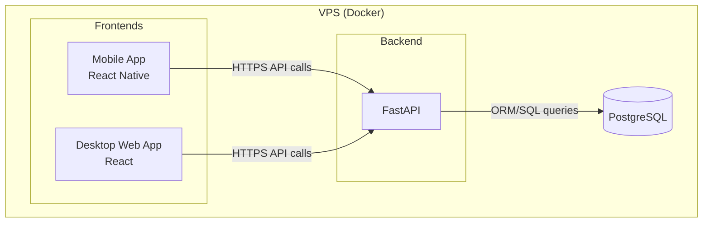

# Projekt systemu
## System architecture diagram


## Backend design
### Folder structure
```
backend/
├── src/
│   ├── repositories/     
│   ├── models/           # Database models 
│   ├── controllers/      # API endpoints
│   └── services/         # Complex business logic
├── unit_tests/           # Test individual functions and services
└── component_tests/      # Test API endpoints and service integration
```
### Flow example (TO BE DONE)


## Frontend design

### Folder structure
```
frontend/
├── src/
│   ├── mobile/           # Mobile side
│   ├── shared/           # Shared files for web and mobile versions
│   └── web/              # Web side
├── unit_tests/           # Test individual functions and services
└── component_tests/      # Test API endpoints and service integration
```
---

#### Web
```
frontend/web/src/
├── theme/               # Material UI theme configuration
├── views/              # Full page components (OrdersPage.tsx, etc)
├── components/         # Reusable UI components (OrderCard, Button, etc)
├── hooks/              # Custom hooks for API calls, should use frontend/shared/api/API.ts 
├── services/           # Business logic combining multiple hooks
└── App.tsx
```

---

#### Shared
```
frontend/shared/
├── api/
│   └── API.ts          # Single centralized API client
├── context/
│   └── types.ts        # Shared TypeScript types/interfaces
└── README.md
```

---

#### Mobile (TO BE SPECIFIED)


### Key Rules

1. **One hook per domain**: `useOrderAPI`, `useUserAPI`, not `fetchOrder.ts`
2. **Types are shared**: Keep them in `frontend/shared/context/types.ts`
3. **API client is centralized**: Use `frontend/shared/api/API.ts` everywhere
4. **Services are optional**: Only create if logic is complex or reused
5. **Components are dumb**: They consume hooks/services, don't call API directly
6. **Hooks are the bridge**: Between API and components

---

### Abstraction level specification
#### ❌ BAD: Too granular

```
ordersAPI/
├── fetchOrder.ts
├── postOrder.ts
├── updateOrder.ts
└── deleteOrder.ts
```

#### ✅ GOOD: Single hook per domain

```
hooks/
└── useOrderAPI.ts      # Contains all Order operations
```

---

## Database design
### Physical Model

### ORM
