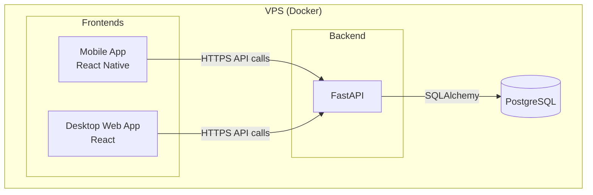
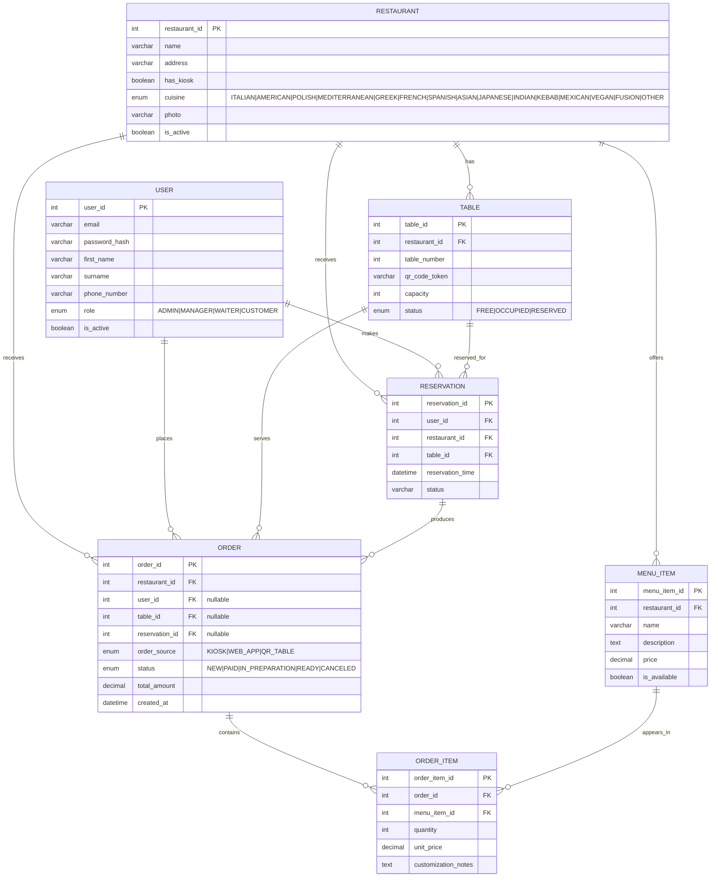

# System Project

## System architecture diagram



## Actors

From what I see we can have four actors inside our app:

1. Customer - a person that can order some food, order a certain table etc.
2. Waiter - a person that can pick up orders from customers.
3. Data Manager - a person who can see the data display on web version of this system.
4. Admin - a person with specified access to whole system.

## Backend design

### Folder structure

```
backend/
├── src/
│   ├── repositories/
│   ├── models/               # Database models
│   ├── controllers/          # API endpoints
│   └── services/             # Complex business logic
└── tests/
    ├── unit_tests/           # Test individual functions and services
    └── component_tests/      # Test API endpoints and service integration
```

### Flow example (TO BE DONE)

## Frontend design

### Folder structure

```
frontend/
├── mobile/            # Mobile side
├── shared/            # Shared files for web and mobile versions
└── web/               # Web side
```

---

#### Web

```
frontend/web/src/
├── views/              # Full page components (OrdersPage.tsx, etc)
├── components/         # Reusable UI components (OrderCard, Button, etc)
├── hooks/              # Custom hooks for API calls, should use frontend/shared/api/API.ts
├── services/           # Business logic combining multiple hooks
└── App.tsx
```

---

#### Shared

```
frontend/shared/
├── api/
│   └── API.ts          # Single centralized API client
├── context/
│   └── types.ts        # Shared TypeScript types/interfaces
├── theme/              # Theme configuration (Material UI)
└── README.md
```

---

#### Mobile (TO BE SPECIFIED)

### Key Rules

1. **One hook per domain**: `useOrderAPI`, `useUserAPI`, not `fetchOrder.ts`
2. **Types are shared**: Keep them in `frontend/shared/context/types.ts`
3. **API client is centralized**: Use `frontend/shared/api/API.ts` everywhere
4. **Services are optional**: Only create if logic is complex or reused
5. **Components are dumb**: They consume hooks/services, don't call API directly
6. **Hooks are the bridge**: Between API and components

---

### Abstraction level specification

#### ❌ BAD: Too granular

```
ordersAPI/
├── fetchOrder.ts
├── postOrder.ts
├── updateOrder.ts
└── deleteOrder.ts
```

#### ✅ GOOD: Single hook per domain

```
hooks/
└── useOrderAPI.ts      # Contains all Order operations
```

---

## Database design

### Physical Model



### ORM

As for object relational mapper SQLAlchemy will be used.
