# Local Setup Guide

This guide will walk you through setting up the project locally for development.

## Prerequisites

Before you begin, ensure you have the following installed:
- [Docker](https://www.docker.com/products/docker-desktop/) and Docker Compose
- [Node.js](https://nodejs.org/) (v18 or higher recommended)
- [Python](https://www.python.org/) (3.10 or higher)
- [Git](https://git-scm.com/)

---

## 1. Clone the Repository

```bash
git clone https://github.com/MatiBukowski/Zastosowania-Informatyki-w-gospodarce-.git
cd Zastosowania-Informatyki-w-gospodarce-
```

---

## 2. Backend Setup

The backend is built with FastAPI and PostgreSQL.

### Environment Variables
1. Navigate to the `backend` directory:
   ```bash
   cd backend
   ```
2. Copy the example environment file:
   ```bash
   cp .env.example .env
   ```
3. Open `.env` and configure the variables (see [Environment Variables Explained](#environment-variables-explained) below).

---

## 3. Frontend Web Setup

The web frontend is built with React and Vite.

1. Navigate to the `frontend/web` directory:
   ```bash
   cd frontend/web
   ```
2. Copy the example environment file:
   ```bash
   cp .env.example .env
   ```
3. Open `.env` and configure the variables (see [Environment Variables Explained](#environment-variables-explained) below).

---

## 4. Frontend Mobile Setup

The mobile app is built with Expo.

1. Navigate to the `frontend/mobile` directory:
   ```bash
   cd frontend/mobile
   ```
2. Copy the example environment file:
   ```bash
   cp .env.example .env
   ```
3. Open `.env` and configure the variables (see [Environment Variables Explained](#environment-variables-explained) below).
4. Install dependencies:
   ```bash
   npm install
   ```
5. Start Expo:
   ```bash
   npx expo start
   ```

---

## 5. Running with Docker Compose (Recommended)

To run the entire stack (Backend + Database + Web Frontend) with a single command:

1. Ensure you have configured the `.env` files in `backend/` and `frontend/web/`.
2. From the project root, run:
   ```bash
   docker-compose up --build
   ```

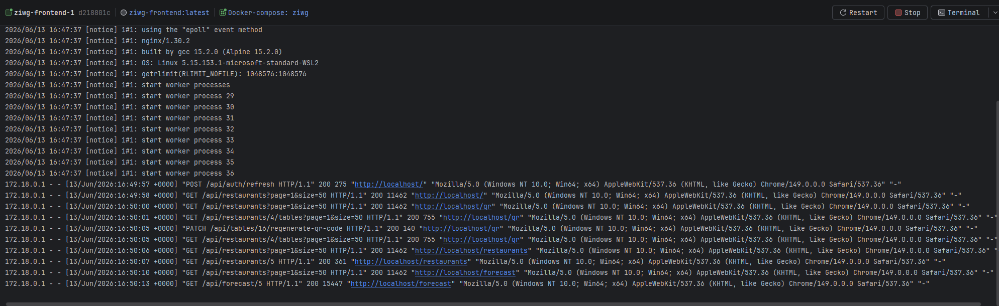
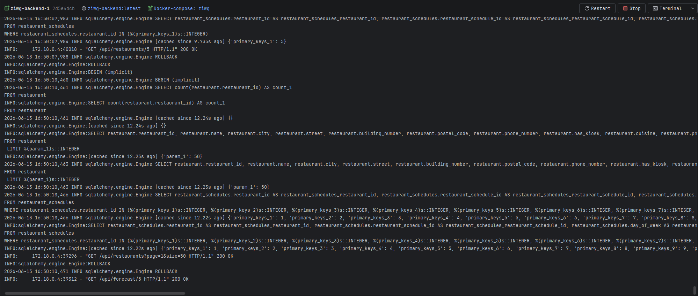
---

## Environment Variables Explained

### Backend (`backend/.env`)

| Variable | Description                                     | Example/Default                            |
| :--- |:------------------------------------------------|:-------------------------------------------|
| `POSTGRES_HOST` | Database host                                   | `localhost` or `db` (for Docker)           |
| `POSTGRES_PORT` | Database port                                   | `5432`                                     |
| `POSTGRES_DB` | Database name                                   | `dev`                                      |
| `POSTGRES_USER` | Database user                                   | `postgres`                                 |
| `POSTGRES_PASSWORD` | Database password                               | `postgres`                                 |
| `POSTGRES_ECHO` | SQL logging                                     | `false`                                    |
| `SEED_DATA` | Populate DB with initial data                   | `false`                                    |
| `JWT_SECRET` | Secret key for JWT tokens                       | `your_secret_key`                          |
| `ACCESS_TOKEN_EXPIRE_MINUTES` | JWT access token lifetime                       | `30`                                       |
| `REFRESH_TOKEN_EXPIRE_DAYS` | JWT refresh token lifetime                      | `30`                                       |
| `POSTHOG_API_KEY` | PostHog analytics API key                       | `phc_...`                                  |
| `POSTHOG_PAT_KEY` | PostHog analytics PAT key                       | `phx_...`                                  |
| `POSTHOG_HOST` | PostHog analytics host                          | `https://eu.i.posthog.com`                 |
| `POSTHOG_ID` | PostHog analytics project id                    | `692137`                                   |
| `RESEND_API_KEY` | API key for Resend email service                | `re_...`                                   |
| `SUPPORT_FROM_EMAIL` | Email address shown as sender                   | `ZIWG Support <onboarding@yourdomain.com>` |
| `SUPPORT_TO_EMAIL` | Email address that will receive support answear | `team@yourdomain.com`                      |
| `SUPPORT_CONTACT_EMAIL` | Email address that will receive support         | `support@yourdomain.com`                   |

### Frontend Web (`frontend/web/.env`)

| Variable | Description | Example/Default            |
| :--- | :--- |:---------------------------|
| `VITE_API_URL` | URL of the backend API | `http://localhost:8080`    |
| `VITE_PUBLIC_POSTHOG_KEY` | PostHog analytics key | `phc_...`                  |
| `POSTHOG_HOST` | PostHog analytics host           | `https://eu.i.posthog.com` |

### Frontend Mobile (`frontend/mobile/.env`)

| Variable | Description | Example/Default            |
| :--- | :--- |:---------------------------|
| `EXPO_PUBLIC_API_URL` | URL of the backend API | `http://192.168.x.x:8080`  |
| `EXPO_PUBLIC_POSTHOG_API_KEY` | PostHog analytics key | `phc_...`                  |
| `EXPO_PUBLIC_POSTHOG_HOST` | PostHog analytics host           | `https://eu.i.posthog.com` |

---

## App Showcase

Here is a quick look at how the application looks and works.

### 1. QR Codes 
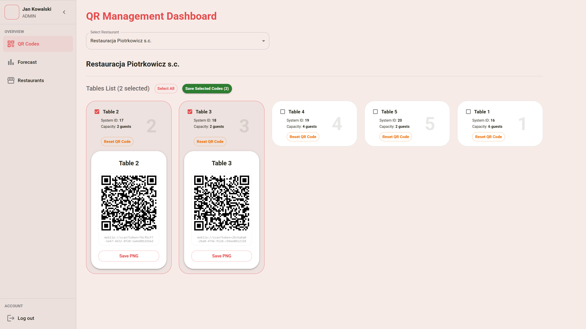
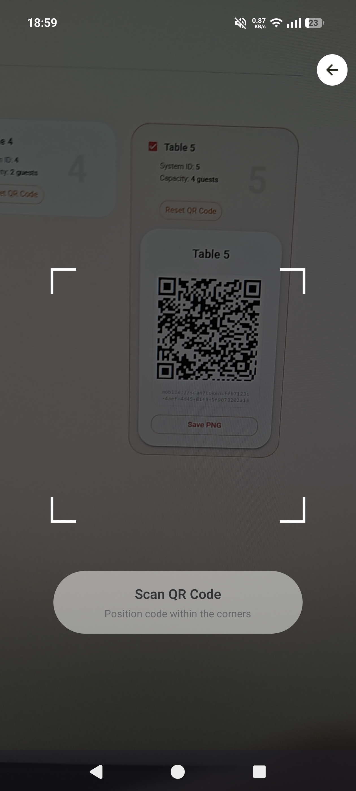

### 2. Forecast
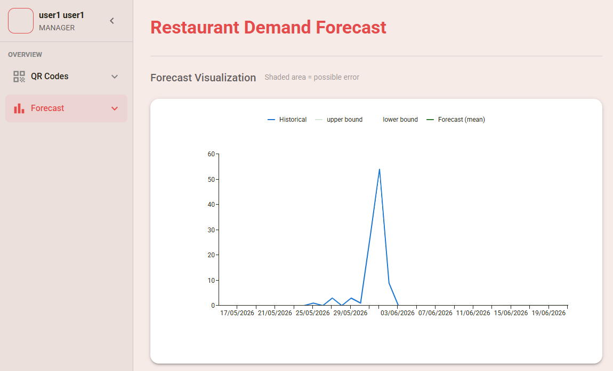

### 3. Restaurants
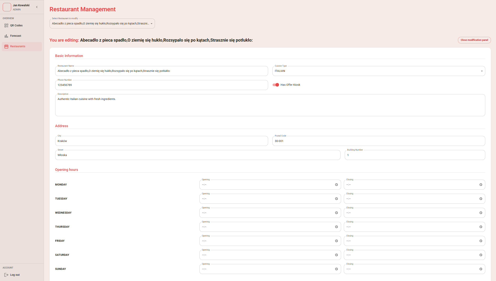
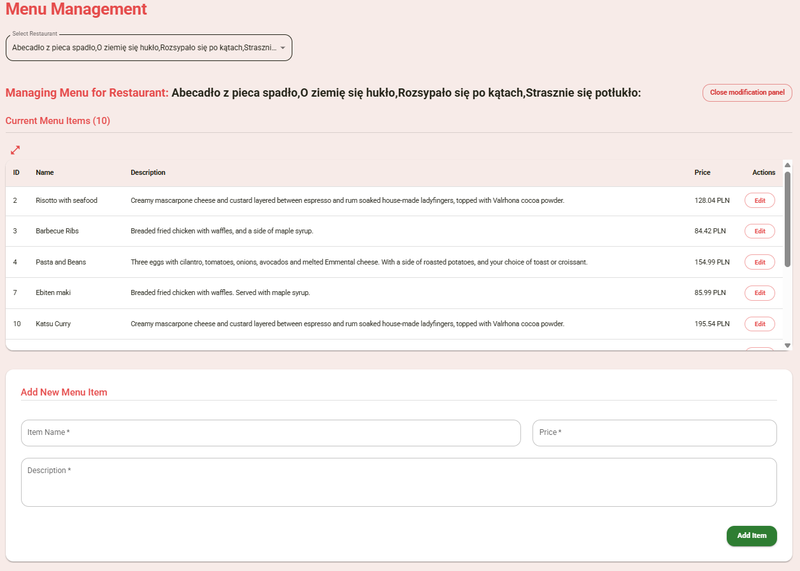
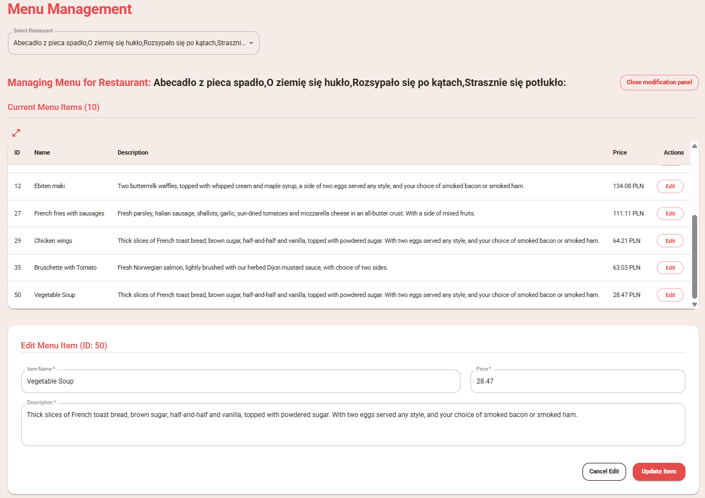


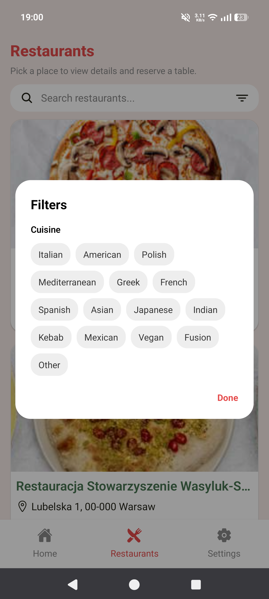


### 4. Ordering
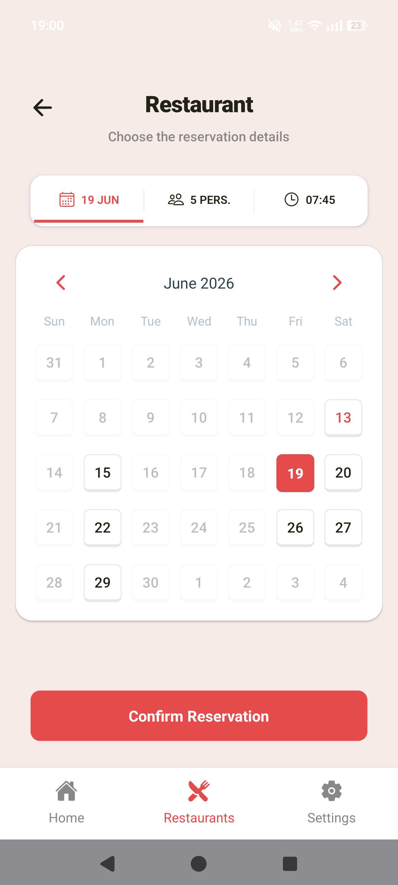
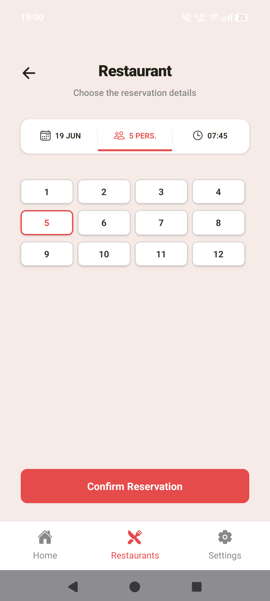
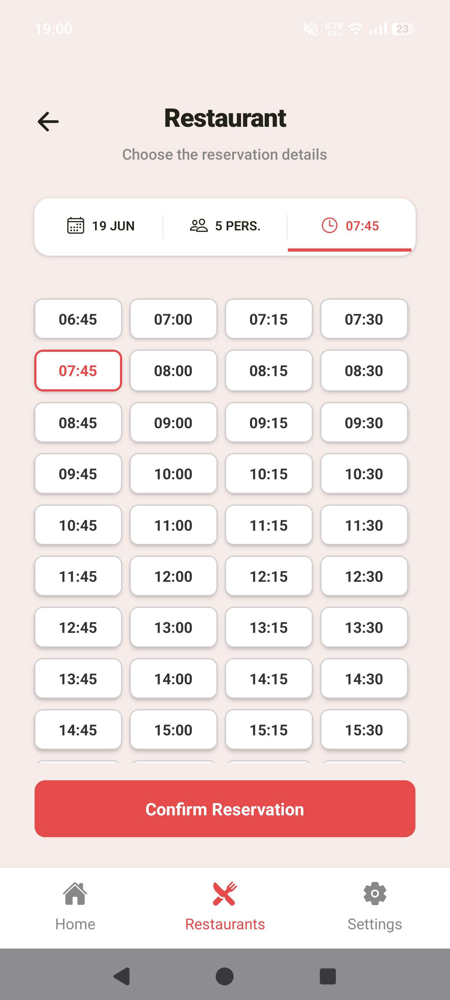
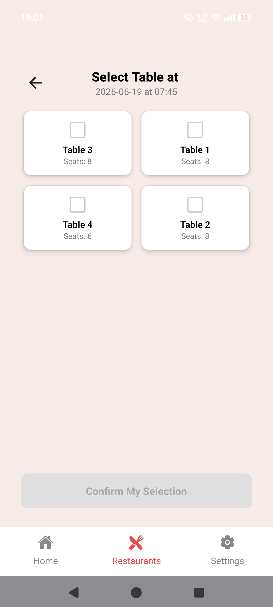
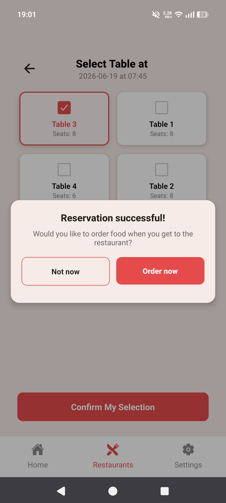


### 5. Profile
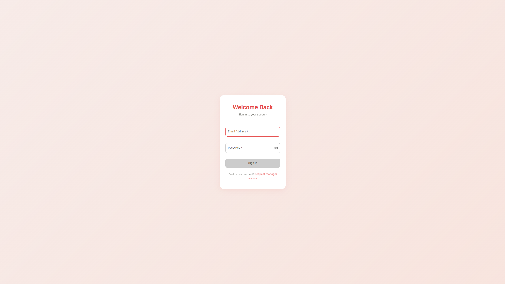
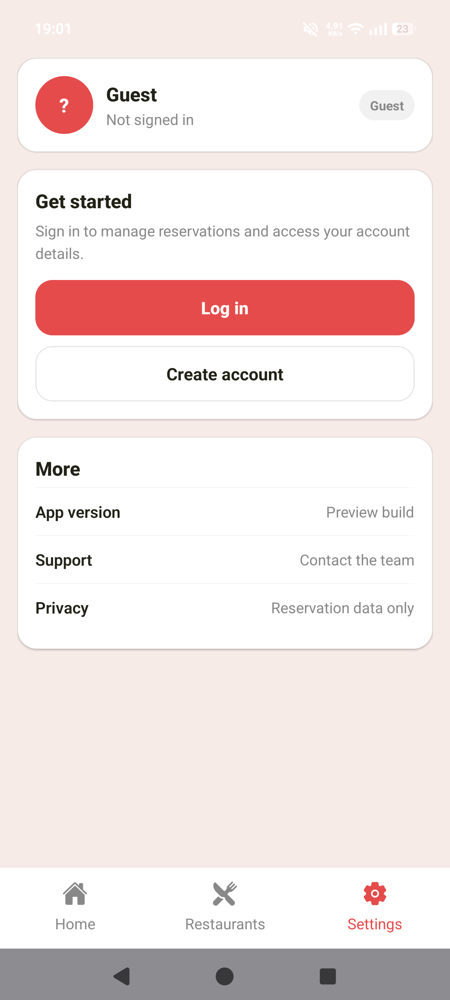
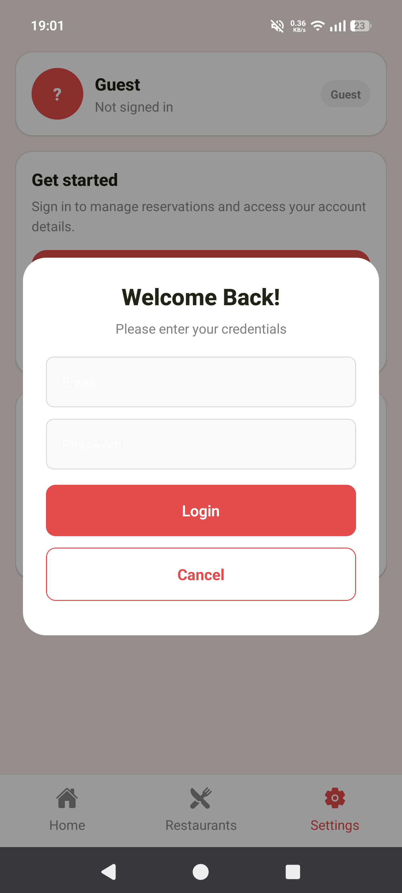
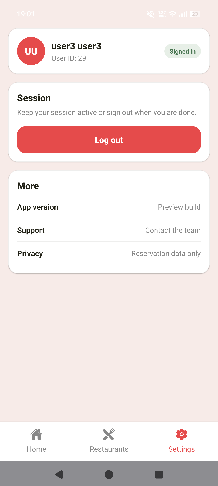


### 6. Support
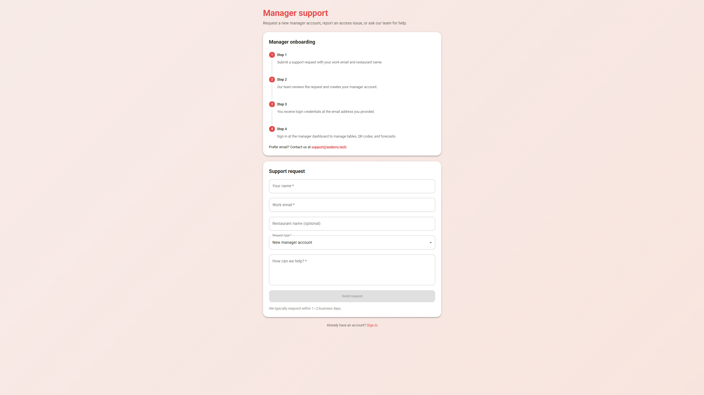
