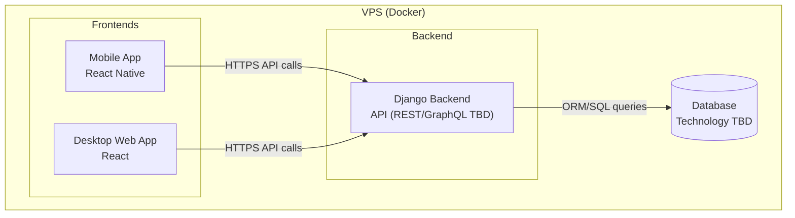

# Zastosowania-Informatyki-w-gospodarce-
Projekt z przedmiotu: Zastosowania Informatyki w gospodarce 

## Projekt systemu

### Diagram architektury systemu

```mermaid
flowchart TB
  subgraph VPS["VPS (Docker)"]
    subgraph FE["Frontends"]
      M["Mobile App<br/>React Native"]
      W["Desktop Web App<br/>React"]
    end

    subgraph BE["Backend"]
      API["Django Backend<br/>API (REST/GraphQL TBD)"]
    end

    DB[(Database<br/>Technology TBD)]
  end

  M -->|"HTTPS API calls"| API
  W -->|"HTTPS API calls"| API
  API -->|"ORM/SQL queries"| DB
```
